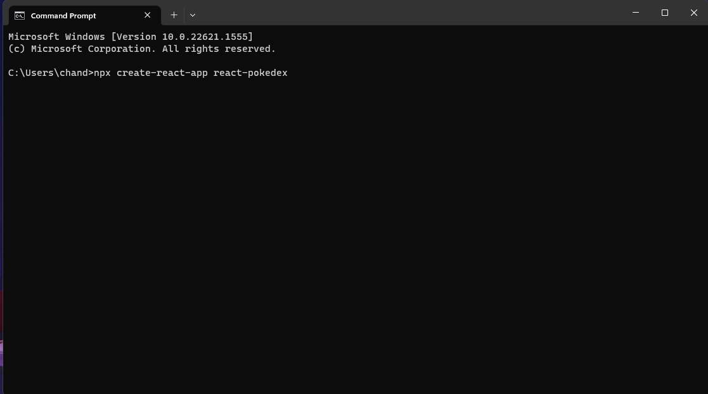
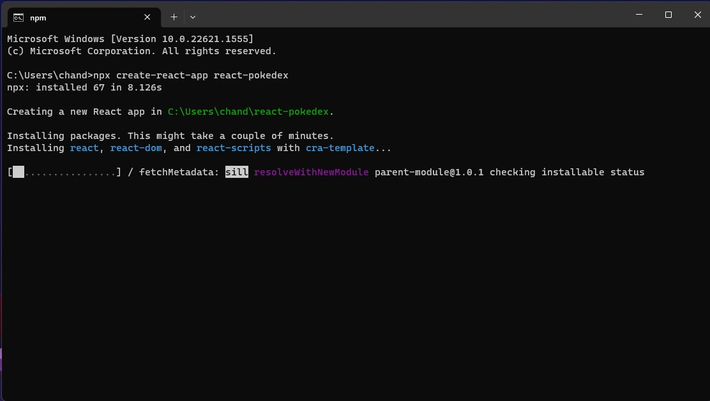
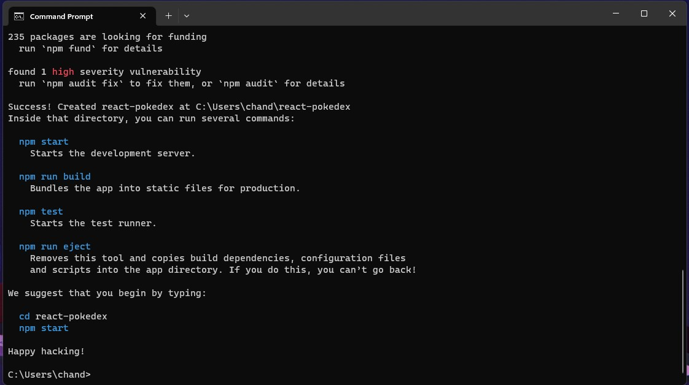
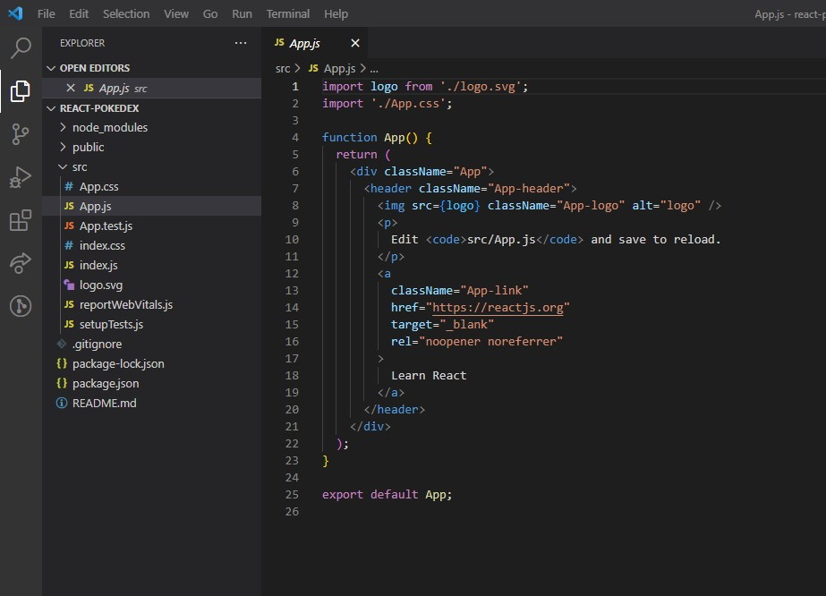

# Create React App
- What problem is this tool trying to solve?
-	Create React App will create you a new react project for you and handle all the needed dependencies and settings.

- How does it solve the problem? AKA, what makes this tool unique?
-	They create all your build settings and make it really easy to manage. They also allow you to “eject” during the process to set up specific settings at different parts of the process. The cli command is really simple for it and you can update all your react scripts with a single command as well. 

- When shouldn't you use this tool?
-	Create React App will create all of your stuff into a single file. So, if you’re looking to make a pretty big application you might now want to use it.

- Name two features you find interesting/useful and explain why they are helpful.
-	For me creating new projects is always the biggest hurdle. I never know what settings I need and what to install. So, this handles all of that for me.
-	All you need to do to update your build tools and scripts is run npm install react-scripts@latest which is really nice. I’m not a fan of having to update my stuff manually.
- What other information should someone know before using this tool?
-	Your file structure needs to match what they built it as in order for the build commands and other scripts to run. 

# Roll Up
- What problem is this tool trying to solve?
-	Javascript is really nice to code in small effective pieces so that you keep things small, and they work well without conflicting with other pieces of code. But Javascript alone wasn’t very good at that previously. They have updated since for browsers but things like Node have been left behind.

- How does it solve the problem? AKA, what makes this tool unique?
-	Roll Up takes all your little “modules” of javascript and “rolls” them up into the old setup of Javascript. That way you can use the new structure for when Node gets updated and then you’re not needing to convert the old structure.

- When shouldn't you use this tool?
-	If you are using “eval” in your code. Rollup compiles everything into a single scope so eval scope becomes “polluted”.

- Name two features you find interesting/useful and explain why they are helpful.
-	Tree Shaking is a really cool feature that goes through your code and removes everything that is not used which makes your code lighter and more effective.
-	Rollup can import old code files via a plugin as well to help combine those with smaller modules.

- What other information should someone know before using this tool?
-	There have been a few versions of Rollup and it does seem like there’s a bit of migration process you have to go through to update to the newer versions.
-	Import syntax is important to make sure that tree shaking works the right way.

# Vite
- What problem is this tool trying to solve?
-	Vite helps speed up build times.

- How does it solve the problem? AKA, what makes this tool unique?
-	It does this by using ES modules and pre-bundling the code. ES modules are the new modularizeds way of writing Javascipt so that makes it faster.  It also contains a dev server.

- When shouldn't you use this tool?
-   Vite currently works with React, Vue, Preact, Svelte, Lit and even vanilla JavaScript and TypeScript. So, if you're not using one of those then you can't use Vite.

- Name two features you find interesting/useful and explain why they are helpful.
-	The ES Modules helps out a lot. Componetization is always a plus for me.
-	There's a lot a different tools you can pair with it. Rollup is included so that's nice.

- What other information should someone know before using this tool?
-   From what I understand, it's still in a beta version so there are occasionaly bugs. New features occasionaly you have to pull commits for before they are released.

# Comparisons

# Each tool performs different tasks for you
-	Create React App is a tool that helps you create a new React project.
-	Rollup is a tool that helps you bundle your code into a single file.
-	Vite is a tool that helps speed up build times.

# They are each unique in their own way
-	Create React App has a lot of different features that help you when creating a new project. It also has a lot of different scripts that help you build and run your project.
-	Rollup has some really cool features with compiling your code.
-	Vite is there to help speed up your build times. RollUp is bundled in with it so you can use that as well.

# When to use them. Together? Separate?
-    Each tool is used in a different way so I see no reason why you couldn't use Create React App to start your new React project and use Vite to speed up your build times and use their dev server. Rollup is bundled in with Vite so you could use that as well. If you're not looking to create react app then You can't use create React App.  If you're creating an application that needs to be bundled then you can use Rollup. If you're looking to speed up your build times then you can use Vite.

# Using Create React App

- You can see that it created all the files as well as packages. It ran an npm i so my node_modules is populated and I'm ready to go!
